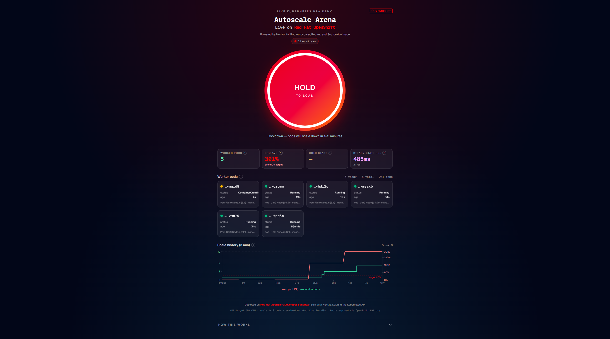

<div align="center">

# Autoscale Arena

### **Watch Red Hat OpenShift autoscale a workload from your phone.**

A live, interactive demo of the Horizontal Pod Autoscaler — built end-to-end on the OpenShift Developer Sandbox, deployed via Source-to-Image, exposed via a Route, and observed via the same Kubernetes API your cluster admin uses.

[**Why OpenShift**](#why-openshift-not-just-kubernetes) · [**The demo**](#the-demo-narrated) · [**Deploy in 5 minutes**](#deploy-in-5-minutes) · [**Architecture**](#architecture)


### This short demo shows RedHat OpenShift autoscaling a worker deployment under generated load. As load increases, worker CPU rises, the Horizontal Pod Autoscaler adds replicas, and the UI tracks pod state and scale history live.



[Watch the 35-second demo video](autoscale-arena-demo.mp4)

**What to watch:**

- Load increases through the UI
- Worker CPU rises
- HPA scales worker pods up
- Pod state updates live from the Kubernetes API
- Scale history changes as the cluster reacts

**Stack:** Next.js · TypeScript · Tailwind · OpenShift
**Live:** [Link](https://autoscale-arena-frontend-alexeyefimik-dev.apps.rm1.0a51.p1.openshiftapps.com/)
<sub>Built with Next.js 16 · Tailwind v4 · `@kubernetes/client-node` · Recharts · Framer Motion</sub>

</div>

---

## What is this

A single-page web app where the user holds a button on their phone, the page hammers a worker pod with hash-loop requests, and an OpenShift HPA scales worker replicas from 1 to 10 in real time. Pod cards animate in and out of existence as the cluster reacts.

The demo is the load generator **and** the visualization. One Next.js codebase, deployed twice from one container image — once as the frontend, once as the worker. Same image, different `WORKER_MODE` env var.

It's a 90-second narrative that compresses the whole autoscaling story into a phone screen:

> Hold the button → CPU climbs → metrics-server scrapes → HPA reconciles → new pods spawn → CPU drops → release the button → cooldown → pods wind back down.

Every visible thing is real. There are no animations driven by `setTimeout`. The pod grid is a live Watch on the Kubernetes API. The CPU number is what `oc get hpa` reports. The replica count is what the controller decided.

---

## Why OpenShift, not just Kubernetes

Vanilla Kubernetes hands you a kit. Red Hat OpenShift hands you an opinionated platform built on that kit, with the boring-but-essential pieces already wired up. This demo lives or dies on six of those pieces, all included:

| Capability | Vanilla K8s | OpenShift |
|---|---|---|
| **Public HTTPS endpoint** | Install + configure an Ingress controller, manage TLS yourself | `Route` resource: declarative HTTPS with edge TLS termination, integrated HAProxy router |
| **Build container from git** | Write a Dockerfile, set up a CI pipeline, push to a registry | **Source-to-Image (S2I)** — `oc new-app nodejs~<git-url>` and you're done |
| **Container registry** | Run your own, or pay a SaaS | Built-in registry with `ImageStream` resources and trigger-based rollouts |
| **Pod security defaults** | Roll your own PodSecurity Admission policies | `restricted-v2` Security Context Constraints applied by default — no root, no privileged, no host paths |
| **Autoscaling out of the box** | Install metrics-server separately, hope you configured RBAC right | metrics-server pre-installed, HPA works against `cpu`/`memory` immediately |
| **Web console for developers** | Install + maintain a third-party dashboard | Topology view, build logs, pod terminals, HPA reconciler events — all in one console |

Every one of these is exercised by this app. The README below maps each demo capability back to the OpenShift feature that made it possible in five lines of YAML instead of fifty.

---

## The demo, narrated

Open the route on your phone. The page connects to a Server-Sent Events stream and starts watching pods in real time.

**1. Press and hold the button.**

The button is a `<motion.button>` with a circular SVG progress ring drawn around it. It uses `framer-motion` for spring physics and respects `prefers-reduced-motion`. Inside the button's `pointerdown` handler, a tight loop fires `POST /api/work` requests at up to 20 RPS, each waiting on the previous to drain — backpressure is built in.

**2. The frontend forwards each tap to the worker Service.**

`/api/work` on the frontend pod isn't where the CPU work happens. It detects the in-cluster ServiceAccount mount, wraps the request, and forwards to `http://autoscale-arena-worker:3000/api/work` — the worker Service's cluster DNS name. The frontend's CPU stays cool; only the worker pods burn cycles. This keeps the HPA's CPU signal a clean reflection of user load.

> Locally (`npm run dev`), there's no ServiceAccount mount, so the same route falls through and runs the hash loop in-process. The mock pod model means you don't need a cluster to develop.

**3. Each worker pod runs a calibrated sha256 hash loop.**

200ms of synchronous CPU per request, broken into 1000-iteration chunks with `await new Promise(r => setImmediate(r))` between chunks. This is the trick that makes the workers survive — without it, a busy pod blocks its own event loop, fails its liveness probe, gets killed, and crash-loops. With it, the pod stays responsive even at saturation while still pinning a CPU core.

**4. metrics-server scrapes pod CPU every 15 seconds.**

This is the unglamorous truth of HPA: it doesn't react instantly. The metrics pipeline is `cAdvisor → kubelet → metrics-server → HPA controller`, each link adding a few seconds of lag. End-to-end you're looking at a 15–30 second delay between "user starts hammering" and "HPA notices."

**5. The HPA controller reconciles.**

The HPA's spec says: keep average CPU across worker pods at 50%. Once metrics-server reports 80% across 1 pod, the controller does the math: `desired = ceil(currentReplicas × currentValue / targetValue) = ceil(1 × 80 / 50) = 2`. It writes that number back to the Deployment's replica count. Built-in scale-up rate limit (+2 pods per 15s) and scale-down stabilization (60s window, 1 pod / 30s) prevent thrashing.

**6. New pods spawn.**

The frontend's SSE stream is a Watch against the Kubernetes API filtered by `app=autoscale-arena-worker`. As soon as a new pod hits `Pending`, then `ContainerCreating`, then `Running`, then `Ready`, an event fires and the UI animates a new card into the grid with a Framer Motion spring transition. Cards sort newest-first so the freshly-spawned pod lands at the top of the user's field of view.

**7. Cold-start latency shows up as a separate metric.**

The first request to a pod whose `startTime` is less than 12 seconds old gets bucketed into the cold-start sample buffer. Steady-state p95 is computed only from pods that have been up for 30+ seconds. Two metrics, two stories: "how slow is a fresh pod to first response?" and "how fast does a warm pod actually serve?"

**8. Release the button.**

CPU drops. Metrics-server takes another 15s to report. The HPA notices the average is below target and starts scaling down — but the 60s stabilization window is there exactly so flapping users don't trigger flapping replicas. After about a minute, pods start getting `terminating` events. The UI catches them in `<AnimatePresence>` and animates them out.

That's the loop. From a phone, in real time, against a real cluster.

---

## What this demo showcases, mapped to OpenShift features

Each section below corresponds to a YAML file in `openshift/` and the OpenShift feature that made it cheap.

### `openshift/frontend.yaml` — Routes

```yaml
kind: Route
spec:
  to: { kind: Service, name: autoscale-arena-frontend }
  port: { targetPort: http }
  tls: { termination: edge }
```

Five lines of YAML get you a public HTTPS endpoint with a real certificate. No Ingress controller installation, no cert-manager configuration, no TLS secret juggling. The HAProxy router is part of the platform; the Route resource is its declarative interface. We add one annotation — `haproxy.router.openshift.io/timeout: 4h` — to keep long-lived SSE connections open past the default 30 second idle timeout.

### `BuildConfig` — Source-to-Image (S2I)

```bash
oc new-app nodejs~https://github.com/Alexey3250/autoscale-arena \
  --name=autoscale-arena-frontend
```

That single command:

1. Creates an `ImageStream` for the source image (`nodejs:22-ubi9`) and the output image (`autoscale-arena-frontend:latest`).
2. Creates a `BuildConfig` with a `Source` strategy pointing at the git URL.
3. Runs the first build immediately: clones the repo, runs `npm ci && npm run build`, layers the result onto the UBI Node.js base image, pushes the result to the internal registry.
4. Creates a `Deployment`, a `Service`, and triggers wired to roll the deployment when a new image lands in the stream.

No Dockerfile in the repo. The S2I builder image knows how to build Node.js apps. UBI9 is the result — a Red Hat hardened, supportable base image. Every subsequent `git push` followed by `oc start-build` redeploys both the frontend and the worker (because both Deployments reference the same ImageStream tag).

### `ImageStream` — internal registry with rollout triggers

```yaml
metadata:
  annotations:
    image.openshift.io/triggers: |
      [{"from":{"kind":"ImageStreamTag","name":"autoscale-arena-frontend:latest"},
        "fieldPath":"spec.template.spec.containers[?(@.name==\"worker\")].image"}]
```

The worker Deployment's image is rewritten by OpenShift every time the source ImageStream gets a new pushed tag. Push code, build runs, image lands in the stream, *both* deployments roll automatically. A vanilla K8s equivalent is at minimum: registry credentials secret, image-pull-secret reference, third-party tool like Argo CD Image Updater or Flux Image Automation, and bespoke webhook glue.

### `openshift/hpa.yaml` — built-in HPA + metrics-server

```yaml
apiVersion: autoscaling/v2
kind: HorizontalPodAutoscaler
spec:
  scaleTargetRef:
    apiVersion: apps/v1
    kind: Deployment
    name: autoscale-arena-worker
  minReplicas: 1
  maxReplicas: 10
  metrics:
    - type: Resource
      resource:
        name: cpu
        target: { type: Utilization, averageUtilization: 50 }
```

That's the entirety of the HPA configuration. It works because metrics-server is installed by default in OpenShift; on a vanilla cluster you'd be one Helm chart and an RBAC bundle away from this even being possible. The `target.averageUtilization: 50` means: keep average CPU across pods at 50% of each pod's CPU `request`. The `request` itself is set in the worker Deployment (`100m`), and the HPA does the arithmetic.

### `openshift/rbac.yaml` — Security Context Constraints + namespace-scoped Roles

```yaml
kind: Role
rules:
  - apiGroups: [""]
    resources: ["pods"]
    verbs: ["get", "list", "watch"]
  - apiGroups: ["autoscaling"]
    resources: ["horizontalpodautoscalers"]
    verbs: ["get", "list", "watch"]
```

The frontend reads pod and HPA state through its own ServiceAccount, scoped to its namespace, with the principle of least privilege baked in. Pods run under OpenShift's default `restricted-v2` SCC: random non-root UID, dropped Linux capabilities, no host network, no host paths, read-only root filesystem possible. Compared to vanilla K8s where PodSecurity Admission is opt-in and the default behavior is "anything goes," OpenShift's defaults are the secure path.

### Developer Console

Not a YAML file but an experience: the OpenShift web console gives you a topology view that shows the frontend Route, the frontend Deployment connected to the worker Service, the worker Deployment with its replica scaler, the HPA's current state, and live build logs — without installing or configuring anything. For a demo audience, this is the difference between "trust me, it's working" and "look, you can see it working."

---

## Architecture

```
Phone browser
    │ HTTPS (Route, edge TLS)
    ▼
┌──────────────────────────────────────────────────────────────┐
│  Frontend Deployment  (WORKER_MODE=false, 1 replica)         │
│  ├── /                     UI · SSE consumer                 │
│  ├── /api/pods/stream      SSE: Watch on pods + HPA poll     │
│  ├── /api/pods/status      One-shot snapshot                 │
│  ├── /api/hpa/status       Reads HPA via @kubernetes/client  │
│  └── /api/work             Forwards POST → worker Service    │
│                                  │                           │
└──────────────────────────────────│───────────────────────────┘
                                   ▼ http://autoscale-arena-worker:3000
┌──────────────────────────────────────────────────────────────┐
│  Worker Deployment    (WORKER_MODE=true, 1..10 replicas)     │
│  ├── /api/work             ~200ms sha256 loop                │
│  └── /api/health           Liveness + readiness target       │
│                                                              │
│                                  ▲                           │
│                                  │  scaleTargetRef           │
└──────────────────────────────────│───────────────────────────┘
                                   │
                          ┌────────┴────────┐
                          │ HorizontalPodAutoscaler
                          │ target: 50% CPU
                          │ scale: 1..10
                          └─────────────────┘
                                   ▲
                                   │ metrics
                          ┌────────┴────────┐
                          │ metrics-server  │
                          └─────────────────┘
```

**Same container image, two deployments, one HPA.** That's the entire shape.

---

## Deploy in 5 minutes

You need an OpenShift cluster. The free [Developer Sandbox](https://developers.redhat.com/developer-sandbox) works — that's what this demo runs on.

```bash
oc login --server=<your-cluster> --token=<your-token>

# Clone, configure RBAC, kick off the S2I build.
git clone https://github.com/Alexey3250/autoscale-arena
cd autoscale-arena/openshift

oc apply -f rbac.yaml
oc new-app nodejs~https://github.com/Alexey3250/autoscale-arena --name=autoscale-arena-frontend
oc apply -f frontend.yaml -f worker.yaml -f hpa.yaml

# Open the live URL.
oc get route autoscale-arena-frontend -o jsonpath='https://{.spec.host}{"\n"}'
```

To watch the autoscaler react in a separate terminal:

```bash
oc get pods -w -l app=autoscale-arena-worker
oc get hpa autoscale-arena-worker -w
```

Detailed runbook with troubleshooting: [`openshift/README.md`](openshift/README.md).

---

## Local development

```bash
npm install
npm run dev
# http://localhost:3000
```

You'll see a single mock pod called `local-worker-0`. Tapping the button runs the sha256 loop in-process — the `/api/work` route detects the missing ServiceAccount mount and skips the upstream forward. Once deployed, the same route forwards to the worker Service.

### Environment variables

| Variable | Default | Purpose |
|---|---|---|
| `WORKER_MODE` | unset (= frontend) | `true` on worker pods, `false`/unset on frontend |
| `WORKER_SERVICE_URL` | `http://autoscale-arena-worker:3000` | Where the frontend forwards `/api/work` |
| `WORKER_LABEL_SELECTOR` | `app=autoscale-arena-worker` | Label selector the SSE Watch uses |
| `HOSTNAME` | set by Kubernetes | Reported as `podName` in `/api/work` response |

---

## Project layout

```
app/
├── page.tsx                        Client UI: hold button, pod grid, metrics, chart, SSE
├── layout.tsx                      Dark theme, Red Hat branding, fonts
├── globals.css                     Tailwind v4 entry + how-it-works disclosure styles
└── api/
    ├── work/route.ts               Worker: CPU loop · Frontend: proxy to worker Service
    ├── health/route.ts             Liveness + readiness target
    ├── hpa/status/route.ts         One-shot HPA snapshot for the page
    └── pods/
        ├── status/route.ts         One-shot pod + HPA snapshot
        └── stream/route.ts         SSE: pod Watch + HPA poll, multiplexed
components/
├── HoldButton.tsx                  Hold-to-load button with progress ring + narrative hints
├── PodGrid.tsx                     Live pod cards with Framer Motion animations
├── MetricsBlock.tsx                Worker pods · CPU avg · cold start · steady-state p95
├── ScaleHistoryChart.tsx           Combined pod-count step + HPA-observed CPU line
└── Tooltip.tsx                     Native-popover-based info tooltips
lib/
├── k8s.ts                          KubeConfig + Watch + HPA reader, mock fallback
├── cpuWork.ts                      Async sha256 loop with setImmediate yields
├── metrics.ts                      Per-pod sample ring buffers
└── types.ts                        Shared interfaces
proxy.ts                            Mode gating (worker vs frontend)
openshift/
├── rbac.yaml                       ServiceAccount + Role + RoleBinding
├── frontend.yaml                   Deployment + Service + Route
├── worker.yaml                     Deployment + Service + ImageChange trigger
├── hpa.yaml                        HorizontalPodAutoscaler (autoscaling/v2)
└── README.md                       Deploy runbook
.s2i/environment                    Source-to-Image build hints
```

---

## Notes on the stack

- **Next.js 16** renamed `middleware.ts` to `proxy.ts`. The mode gate uses an exported `proxy` function.
- **Tailwind v4** is CSS-first; theme tokens live in `app/globals.css` under `@theme`. There is no `tailwind.config.ts`.
- **Recharts** ships SSR warnings during prerender; the chart is loaded via `next/dynamic({ ssr: false })`.
- **Framer Motion** powers pod entry/exit and the hold button. Animations honor `prefers-reduced-motion` everywhere.
- **No persistence, no auth, no database.** All state is pod memory or browser memory. The point is the platform.

---

## Built by Alexey Efimik

Looking for a Solution Architect role at Red Hat or any company building on OpenShift. This demo is the kind of thing I want to do all day: take an abstract platform capability, build a tight feedback loop around it, and make the value visible to humans.

[**Source on GitHub**](https://github.com/Alexey3250/autoscale-arena) · [**LinkedIn**](https://www.linkedin.com/in/efimik/) · [**Email**](mailto:a.efimik@gmail.com) · [**WhatsApp**](https://wa.me/971527846185)

<sub>Deployed on Red Hat OpenShift Developer Sandbox. Container image built from this repo via Source-to-Image. Exposed via a Route with edge TLS termination. Scaled by the platform's built-in HorizontalPodAutoscaler against metrics-server samples. No external services were harmed in the making of this demo.</sub>
